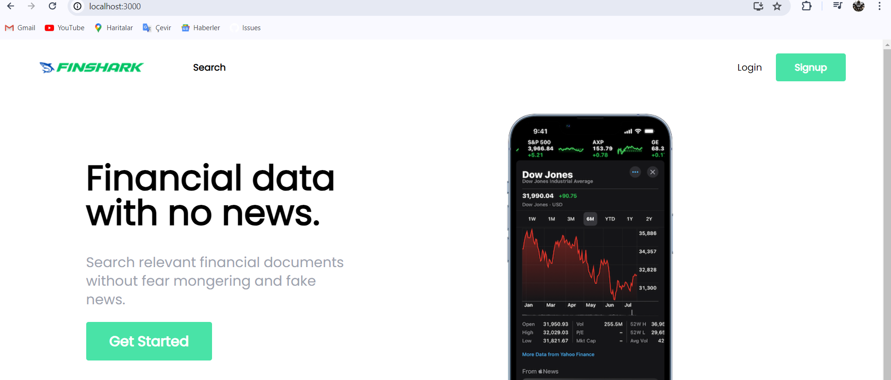
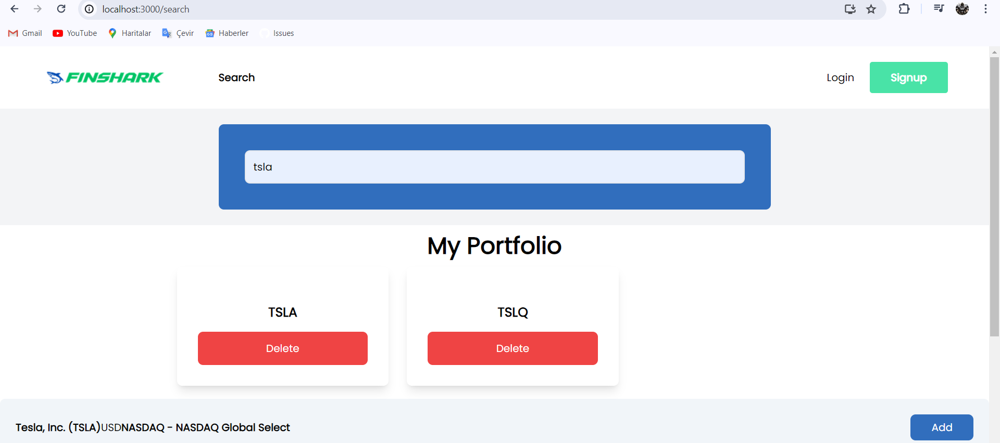

# Finance Application

## Introduction
Welcome to the Finance Application, a powerful tool designed to help you stay informed about financial markets and make informed decisions. This application fetches data from the Financial Modelling Prep API and utilizes the latest technologies to provide a seamless user experience.

## Features
- Fetch data from the Financial Modelling Prep API
- Frontend built with React and TypeScript
- Styled with Tailwind CSS
- Backend built with .NET Core 8 Minimal API

## Getting Started
To get started with the Finance Application, follow these simple steps:

1. Clone the repository to your local machine.
2. Install the required dependencies by running `npm install` or `yarn install` in the project directory.
3. Set up your environment variables by creating a `.env` file in the root directory.
4. Start the development server by running `npm start` or `yarn start`.

## Contributing
We welcome contributions from the community! If you'd like to contribute to the Finance Application, please follow these guidelines:

1. Fork the repository.
2. Create a new branch for your feature or bug fix.
3. Make your changes and test them thoroughly.
4. Submit a pull request with a clear description of your changes.

## Contact
For any questions or inquiries, please feel free to contact me at mammadzade03@gmail.com.

## Screenshots
Here are some screenshots of the Finance Application in action:

